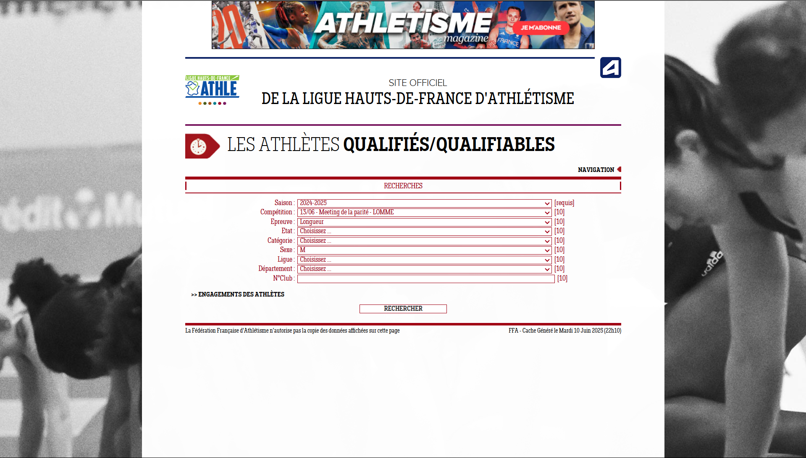

# Ajouter un lien dans l’application

## 1. Sélection du département

1. Cliquez sur le lien correspondant au département où se déroule la compétition.  
2. Vous serez redirigé(e) vers le formulaire des engagements.

- [Ligue Hauts-de-France](https://bases.athle.fr/asp.net/accueil.aspx?frmbase=qualifies&frmmode=0&frmespace=37)  
- [Comité de l’Aisne (02)](https://bases.athle.fr/asp.net/accueil.aspx?frmbase=qualifies&frmmode=0&frmespace=1143)  
- [Comité du Nord (59)](https://bases.athle.fr/asp.net/accueil.aspx?frmbase=qualifies&frmmode=0&frmespace=73)  
- [Comité de l’Oise (60)](https://bases.athle.fr/asp.net/accueil.aspx?frmbase=qualifies&frmmode=0&frmespace=1485)  
- [Comité du Pas-de-Calais (62)](https://bases.athle.fr/asp.net/accueil.aspx?frmbase=qualifies&frmmode=0&frmespace=118)  
- [Comité de la Somme (80)](https://bases.athle.fr/asp.net/accueil.aspx?frmbase=qualifies&frmmode=0&frmespace=1170)  

---

## 2. Remplissage du formulaire

Prenons l’exemple du « Meeting de la Parité » et souhaitons obtenir la liste des engagés au concours de longueur masculin.

1. Vérifiez que vous êtes bien sur la page d’accueil du formulaire :  
   

2. Dans le formulaire, renseignez :
   - **Saison :** 2024-2025  
   - **Compétition :** `13/06 – Meeting de la Parité – LOMME`  
   - **Épreuve :** Longueur  
   - **Sexe :** M  
   - Laissez les autres champs vides.

3. Cliquez sur **Rechercher**.  

Vous obtenez alors la liste des engagés.



---

## 3. Récupération du lien

1. Une fois la liste affichée, copiez l’URL dans la barre d’adresse de votre navigateur.  
2. Collez ce lien dans l’application pour l’ajouter.

**Exemple d’URL :**
```txt
https://bases.athle.fr/asp.net/liste.aspx?frmpostback=true&frmbase=qualifies&frmmode=1&frmespace=37&frmsaison=31&frmcompetition=42441&frmepreuve=Longueur&frmetat=&frmcategorie=&frmsexe=M&frmligue=&frmdepartement=&frmclub=
```
